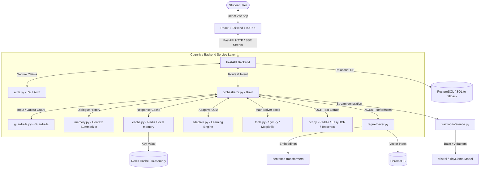

# 🎓 JEE Mentor AI — Advanced IIT-JEE Personal AI Tutor Platform

JEE Mentor AI is a production-grade, advanced AI tutoring platform designed specifically for students preparing for **JEE Main and JEE Advanced** exams. The system features a modular clean architecture combining a custom-synthesized dataset, an automated QLoRA PEFT fine-tuning pipeline, a high-precision semantic RAG retriever, a JWT-secured FastAPI backend with cognitive orchestration, a tiered OCR system, and a breathtaking, glassmorphic React dashboard UI.

---

## 🚀 Key Features

*   **Custom JEE Dataset Pipeline**: Automatically synthesizes and cleans over 1100+ high-quality distinct JEE problems, standardizing mathematical annotations to strict LaTeX format.
*   **QLoRA Fine-Tuning Pipeline**: NF4 4-bit quantization model tuning supporting TinyLlama, Phi-2, and Mistral, utilizing gradient checkpointing to fit in consumer GPUs.
*   **Semantic RAG Indexing**: Integrates local `sentence-transformers` and `ChromaDB` to fetch NCERT theorems and formula guides, avoiding conceptual hallucinations.
*   **Cognitive Orchestrator**: Intent parsing engine routing requests dynamically between SymPy equation solvers, arithmetic calculators, and Matplotlib neon graph plotters.
*   **Tiered OCR Solver**: Three-stage OCR pipeline (PaddleOCR -> EasyOCR -> Tesseract) parsing handwritten and printed JEE questions seamlessly.
*   **Adaptive Practice Engine**: Tracks student mistakes and proficiency history using exponential moving averages, dynamically scaling quiz difficulties (Easy -> Medium -> Hard) to reinforce weak concepts.
*   **NTA-Style CBT Mock Interface**: Online practice workspace mirroring the national JEE CBT portal, featuring a digital scratchpad canvas drawing pad and a countdown clock.
*   **Masthead Analytics**: Beautiful Area and Radar charts representing subject mastery rates and tracking flagged revision chapters.

---

## 🛠️ Technology Stack

*   **Causal LLM Model**: TinyLlama-1.1B / Phi-2 (local debug) | Mistral-7B / Llama-3-8B (production)
*   **Quantization & PEFT**: Hugging Face `transformers`, `peft` (LoRA), `trl` (SFTTrainer), `bitsandbytes` (4-bit NF4)
*   **Vector Database**: ChromaDB (Disk persisted cosine HNWS space)
*   **Embeddings**: sentence-transformers/all-MiniLM-L6-v2 (384-dimensions)
*   **Backend Framework**: FastAPI (Async, JWT Security, Thread-Safe sliding-window IP rate-limiter, Redis / memory Cache)
*   **Database ORM**: SQLAlchemy (PostgreSQL / local SQLite auto-fallback)
*   **Math Solvers**: SymPy (Algebraic equations), Matplotlib/Numpy (Function graphing)
*   **Frontend SPA**: Vite + React 18, Tailwind CSS (Glassmorphism theme), Framer Motion, Recharts, KaTeX math typesetting

---

## 📂 System Architecture



---

## 📦 Directory Structure

```
jee-mentor-ai/
│
├── backend/             # FastAPI Application Layer
│   ├── main.py          # API Routers & endpoints
│   ├── orchestrator.py  # Intent detection, tool executing, context assembly
│   ├── guardrails.py    # Input redirection, LaTeX balancing, constant audits
│   ├── adaptive.py      # Proficiency tracking, personalized tests
│   ├── tools.py         # Arithmetic calc, SymPy, matplotlib graph plotting
│   ├── auth.py          # JWT sign, verify, bcrypt password hashing
│   ├── database.py      # SQLAlchemy binding (Postgres / SQLite)
│   ├── cache.py         # Redis caching (with local in-memory fallback)
│   ├── memory.py        # Dialogue turns counter & summarizer
│   ├── models.py        # SQLAlchemy schema definitions
│   └── schemas.py       # Pydantic v2 validation models
│
├── dataset/             # Question Synthesis Pipeline
│   ├── dataset_generator.py  # Continuous parameterized programmatic synth
│   ├── dataset_cleaner.py    # Cosine deduplication & LaTeX standardization
│   └── dataset_validator.py  # Strict schema validator & distribution statistics
│
├── training/            # PEFT QLoRA Fine-tuning
│   ├── config.py        # bitsandbytes & LoRA hyperparameter configuration
│   ├── train.py         # SFTTrainer training pipeline
│   ├── inference.py     # Dual-mode streaming loader (GPU production / CPU mock)
│   └── evaluate.py      # Validation loss & perplexity auditor
│
├── rag/                 # Semantic Knowledge Index
│   ├── embeddings.py    # Local MiniLM-L6-v2 vectorizer
│   ├── vector_store.py  # Persistent ChromaDB client wrapper
│   ├── ingest.py        # Recursive text splitter & formula corpus seeder
│   └── retriever.py     # Cosine HNWS index semantic search
│
├── evaluation/          # System Benchmarking
│   ├── benchmark.py     # Runs test cases through solver pipelines
│   └── evaluation_report.py  # Generates Jaccard overlap & latency audits
│
├── frontend/            # React Client SPA
│   ├── src/
│   │   ├── components/  # MathRenderer (KaTeX markdown), Navbar
│   │   ├── pages/       # Login, Dashboard, ChatTutor, MockTest, Analytics
│   │   ├── App.jsx      # Session state and view router
│   │   └── index.css    # Typography and radial background gradients
│   ├── tailwind.config.js
│   └── vite.config.js
│
├── docker-compose.yml   # Multi-container local orchestration
├── requirements.txt     # Python packages index
├── .env.example         # System configuration variables
└── scripts/             # One-click startup scripts
    ├── setup.ps1        # Windows automated setup
    └── setup.sh         # Linux/macOS automated setup
```

---

## ⚡ Quick Start Guide

### Option 1: Standard Local Dev Setup (Recommended)

1.  **Run the automated Setup Wizard**:
    *   **Windows**: Open PowerShell in the project directory and run:
        ```powershell
        Set-ExecutionPolicy Bypass -Scope Process; .\scripts\setup.ps1
        ```
    *   **Linux/macOS**: Open Terminal and run:
        ```bash
        chmod +x ./scripts/setup.sh && ./scripts/setup.sh
        ```
2.  **Seed the Vector Database**:
    ```bash
    source venv/bin/activate  # venv\Scripts\activate on Windows
    python -m rag.ingest
    ```
3.  **Boot the FastAPI Backend**:
    ```bash
    uvicorn backend.main:app --reload --port 8000
    ```
4.  **Boot the Vite React Frontend**:
    ```bash
    cd frontend
    npm install
    npm run dev
    ```
    Open `http://localhost:5173` in your browser.

### Option 2: Docker Compose Setup

Launch the entire ecosystem (PostgreSQL, Redis, FastAPI backend, and Nginx React server) with a single command:
```bash
docker-compose up --build
```
Open `http://localhost` (Port 80) to access the platform.

---

## 🧠 QLoRA PEFT Fine-Tuning Instructions

1.  **Configure training settings** inside `training/config.py`.
2.  **Launch the SFT Trainer**:
    ```bash
    python -m training.train
    ```
    The script prepares the model in 4-bit precision, applies LoRA, formats the training dataset prompts, splits validation, and trains the model.
3.  **Audit metrics and perplexity**:
    ```bash
    python -m training.evaluate
    ```
    Saves adapter configurations in `./models/adapters/`.

---

## 📡 REST API Documentation

### Authentication Boundaries
*   `POST /register`: Registers a student.
    *   **Body**: `{ email, username, password, full_name }`
*   `POST /login`: Validates credentials and returns JWT bearer.
    *   **Body**: `{ email, password }`
    *   **Response**: `{ access_token, token_type }`

### Tutoring Boundaries (JWT Secured)
*   `POST /chat`: RAG-infused chat response Streaming (text/event-stream).
    *   **Body**: `{ message, session_id }`
    *   **Header**: `Authorization: Bearer <TOKEN>`
*   `POST /solve`: Multi-tier OCR solver. Takes a photo (base64) or question text, executes SymPy, generates a Matplotlib graph base64, and returns the solution.
    *   **Body**: `{ question_text, image_base64, subject }`

### Adaptive practice boundaries (JWT Secured)
*   `POST /generate-test`: Generates personalized difficulty-adjusted practice quizzes.
    *   **Body**: `{ subject, topics, difficulty, num_questions }`
*   `POST /submit-test`: Submits quiz attempts and recalculates running proficiencies.
    *   **Body**: `{ subject, topics, score, total_questions, question_attempts }`
*   `GET /analyze`: Returns overall streaks, accuracy totals, and flagged weak revision chapters.

---

## 🔮 Sample Solver Output (Physics Electrostatics)

**Input question**:
> Calculate the electric field intensity due to an infinite line charge of linear density $\lambda = 5 \times 10^{-6}$ C/m at a distance of $r = 0.5$ m from the wire.

**AI Tutor Output**:
> To find the electric field due to an infinite linear charge, we apply Gauss's Law:
>
> ### Step 1: Standard formula
> $$E = \frac{\lambda}{2\pi\epsilon_0 r}$$
>
> ### Step 2: Coulomb constant conversion
> We substitute $k = \frac{1}{4\pi\epsilon_0} = 9 \times 10^9$ N.m^2/C^2:
> $$E = \frac{2k\lambda}{r}$$
>
> ### Step 3: Numerical calculation
> Given:
> - $\lambda = 5 \times 10^{-6}$ C/m
> - $r = 0.5$ m
> - $k = 9 \times 10^9$ N.m^2/C^2
>
> $$E = \frac{2 \times (9 \times 10^9) \times (5 \times 10^{-6})}{0.5}$$
> $$E = \frac{90 \times 10^3}{0.5}$$
> $$E = 1.80 \times 10^5 \text{ N/C}$$
>
> ### Conclusion
> The electric field intensity at a distance of 0.5 m is **$1.80 \times 10^5$ N/C**.
